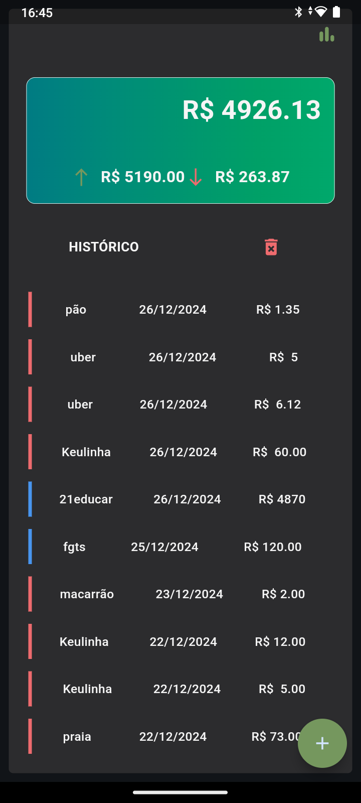
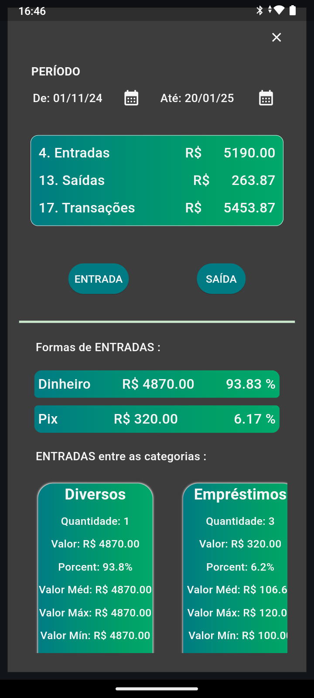
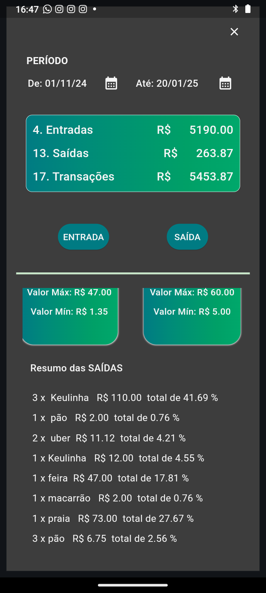

---

# Aplicativo de Controle Financeiro

## Descrição  
O **Aplicativo de Controle Financeiro** é uma solução desenvolvida em Python utilizando a biblioteca **Flet**, projetada para facilitar o gerenciamento de finanças pessoais. O aplicativo fornece uma interface intuitiva e eficiente para registrar e analisar transações financeiras, oferecendo insights úteis para auxiliar na tomada de decisões.

---

  
  &nbsp;&nbsp;&nbsp;
  
  &nbsp;&nbsp;&nbsp;
  

>

## Funcionalidades  
### Registro de Transações  
- Cadastro de entradas e saídas financeiras.  
- Organização das transações por **categorias** (lazer, alimentação, esporte, moradia, etc.).  
- Registro detalhado com informações como:  
  - **Forma de pagamento**: dinheiro, Pix, cartão, fiado, ou outro.  
  - **Descrição** da transação.  
  - Data e hora do registro.  

### Histórico de Transações  
- Exibição completa de todas as transações registradas.  
- Filtros por período, categoria ou forma de pagamento.  

### Análises Financeiras  
- Cálculos automáticos de:  
  - **Total de entradas e saídas**.  
  - Saldo atual.  
  - Distribuição percentual entre categorias.    

---

## Melhorias Futuras  
### Integração com Power BI  
- Implementação de uma funcionalidade para análise avançada dos dados financeiros exportados.  
- Dashboards personalizados no Power BI, com foco em:  
  - Comportamento das transações.  
  - Identificação de padrões de gastos.  
  - Relatórios visuais interativos e dinâmicos.  

### Otimização do Código  
- Refatoração do código para melhorar desempenho e legibilidade.
- Visualização gráfica dos dados financeiros.
- Implementação de padrões de design para facilitar futuras expansões.

### Novas Funcionalidades Planejadas  
- **Formulário de Sentimentos e Categorias Avançadas:**  
  - Adição de um formulário para classificar transações de saída com informações emocionais e contextuais.  
  - Identificação de sentimentos associados a determinados gastos, como "frequênca", "necessidade", ou "satisfação".  
  - Auxílio na identificação de padrões de gastos que possam ser ajustados para economizar ou planejar o uso futuro de valores.  

- **Machine Learning para Análise Preditiva:**  
  - Utilização de algoritmos de aprendizado de máquina para sugerir otimizações no planejamento financeiro.  
  - Detecção de tendências de gastos recorrentes e recomendações para redução de despesas.  
  - Previsão de saldo baseado em comportamentos anteriores e metas estabelecidas.  

- **Alertas financeiros:** notificação para categorias ou limites de gastos excedidos.  
- **Planejamento financeiro:** funcionalidade para definir metas e acompanhar o progresso.  
- **Backup:** opção para salvar dados na nuvem ou no dispositivos.  

---

## Tecnologias Utilizadas  
- **Linguagem:** Python  
- **Bibliotecas:** Flet, Pandas, openpyxl, os, datetime 
- **Ferramentas:** Microsoft Power BI (para análises avançadas)  
- **Futuro:** Algoritmos de Machine Learning (scikit-learn).  

